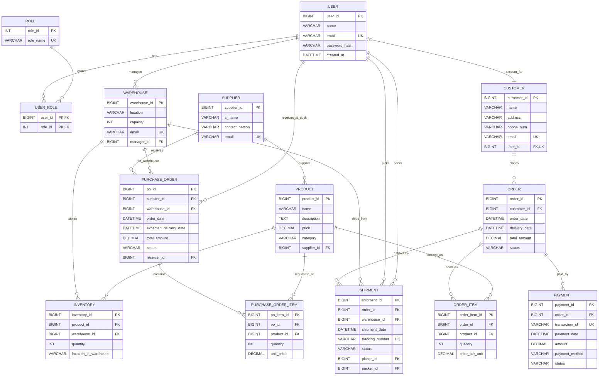

# Final Warehouse Management System ERD

## Notes
- `USER_ROLE` is a composite-key mapping table (`user_id`, `role_id`).
- `CUSTOMER.user_id` is optional and unique to support guest customers and registered customers.
- `INVENTORY` enforces a unique pair on (`product_id`, `warehouse_id`).
- Operational responsibility links are explicit:
  - `WAREHOUSE.manager_id`
  - `PURCHASE_ORDER.receiver_id`
  - `SHIPMENT.picker_id`
  - `SHIPMENT.packer_id`
